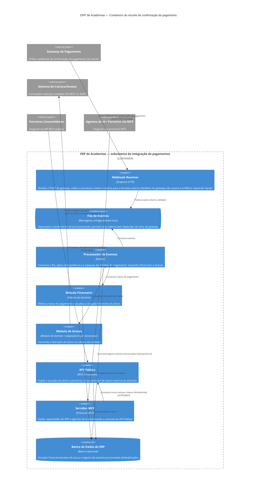

# ERP de Academias — Discovery da Integração de Pagamentos

Documentação de arquitetura do recorte: recebimento do webhook de
confirmação de pagamento, baixa financeira, liberação de acesso na
catraca e disponibilização do evento para parceiros.

- [Descrição do sistema](docs/descricao.md)
- [Lacunas e perguntas de esclarecimento](docs/lacunas.md)
- Fonte do diagrama: [`diagramas/containers.mmd`](diagramas/containers.mmd)

## Diagrama estrutural — C4 nível 2 (Containers)

### Suposições adotadas (hipóteses de trabalho — validar contra o sistema real)

Referências: lacunas LC01–LC10 e respostas de trabalho Q1–Q8 em
[docs/lacunas.md](docs/lacunas.md).

- **H01 (LC01/Q1)** — Processamento assíncrono com fila real: o Webhook
  Receiver valida a assinatura, publica na fila e responde imediatamente.
- **H02 (LC02/Q2)** — O 200 devolvido ao gateway confirma recebimento
  durável (evento aceito e enfileirado), não o processamento completo.
- **H03 (LC03/Q3)** — Idempotência por ID do evento do gateway;
  deduplicação no Processador de Eventos, com registro durável dos
  eventos processados.
- **H04 (LC05)** — Banco único do ERP, que persiste a situação do aluno
  e o registro de eventos processados; a API Pública lê a situação nele.
- **H05 (LC06/Q5)** — Parceiros são notificados apenas por polling na
  API Pública; webhook de saída fica como evolução de roadmap e não
  aparece no diagrama.
- **H06 (LC07/Q8)** — O Servidor MCP aparece como container na fronteira
  do sistema e consome a API Pública — nunca o banco; está fora da
  jornada crítica da sequência.
- **H07 (LC08/Q6)** — Módulo de Acesso único, com adaptadores por
  fornecedor (REST/SOAP); a variação é detalhe de integração, uma só caixa.
- **H08 (LC04/Q4 e LC09/Q7)** — Reconciliação de eventos fora de ordem e
  DLQ da catraca existem como mecanismos da infraestrutura de mensageria
  e do processador; não são containers separados neste nível.

## Checklist de revisão — limites, dependências e vazamentos

- [ ] O diagrama contém apenas o nível container (nenhum componente
      interno, classe ou endpoint listado)?
- [ ] Gateway de Pagamento, Sistema de Catraca e Parceiros/Agentes de IA
      estão todos marcados como sistemas externos (`System_Ext`)?
- [ ] Nenhum detalhe do gateway (payload, códigos, formato de assinatura)
      aparece além da fronteira do Webhook Receiver — a tradução para o
      formato interno acontece ali?
- [ ] A API Pública é o único caminho de entrada para parceiros — não
      existe nenhuma seta de parceiro para módulo interno, fila ou banco?
- [ ] O Servidor MCP consome exclusivamente a API Pública — não há seta
      MCP → banco nem MCP → módulos internos?
- [ ] Frontend/app não aparece acessando fila ou processador (restrição
      da descrição) — e, se ausente do diagrama, isso está coerente com o
      recorte declarado?
- [ ] O ponto de deduplicação (Processador + registro no banco) está
      visível e coerente com a hipótese H03 — retry do gateway ou
      reentrega da fila não duplicam baixa nem liberação?
- [ ] A direção das dependências está correta: o Processador orquestra
      Financeiro e Acesso, e não o contrário?
- [ ] A baixa financeira e a liberação de acesso estão desenhadas como
      efeitos independentes (falha na catraca não desfaz a baixa — H08)?
- [ ] Cada container do diagrama está sustentado pela descrição ou por
      uma hipótese H01–H08 explícita (nada foi inventado "por boas
      práticas": sem cache, BFF, API gateway etc.)?
- [ ] Toda suposição estrutural do diagrama tem um H numerado que
      referencia a lacuna correspondente (LC01–LC10) do lacunas.md?
- [ ] As lacunas ainda abertas (ex.: LC10 — autenticação de parceiros)
      permanecem registradas como lacunas, sem terem sido "resolvidas"
      silenciosamente no diagrama?
